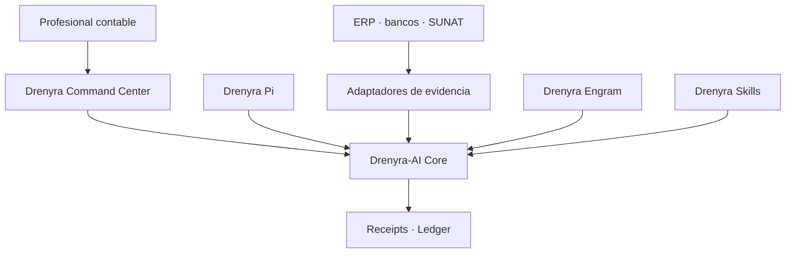

# Ecosystem Boundaries — Drenyra Engram (Institutional Accounting Memory)

> **Last updated:** 2026-08-11 (Design 1 — boundary & authority contract).

> Fiscal convention: monetary values in the Drenyra ecosystem are BigInt cents; no float is ever used for money; version/sequence numbers are JSON integers, never floats.

## Role in the ecosystem

Drenyra Engram is the **Institutional Accounting Memory**: scope-first memory for companies, fiscal periods, policies, and institutional knowledge. It is the direct accounting-domain counterpart of Engram.

Drenyra Engram is **independent**: it has no dependencies on Drenyra, Drenyra AI, or Drenyra Pi, and the other three may read from it. It preserves what the organization knows and can prove about its accounting — **remember is not authorize**.

## What Drenyra Engram is (in scope)

- **Observations** — structured memories with type, scope, topic key, and content.
- **Institutional knowledge** — policies, conventions, and precedents that outlive sessions.
- **Mission summaries and learnings** — persisted for cross-session recovery.
- **Relations** — `related`, `supersedes`, `conflicts_with`, and more between memories.
- **Vigencia** — effective/expiry semantics so stale knowledge is visible, not silently trusted.
- **Provenance** — who/what/when/why for every observation, auditable.
- **Scope-first search** — company/RUC/period filters are structural, not post-filters.
- **Local and cloud memory** — with clear, tombstone-aware sync semantics.
- **Surfaces** — MCP, HTTP, CLI, TUI over the same engine.

## Explicit non-goals

Drenyra Engram is **not**:

- An authorization engine. It has no authority model; no observation is ever approval, permission, or authorization.
- A receipt engine for other products' acts. Since v0.4.0 (Step 3) Engram emits
  Ed25519 receipts for ITS OWN immutable acts (memory_recorded, memory_approved,
  memory_rejected, memory_voided, relation_confirmed, relation_rejected,
  evidence_linked, memory_superseded); cross-product authorization gates remain
  in `drenyra-ai`.
- A product UI or Pi harness. Those belong to Drenyra and `drenyra-pi`.

## What Drenyra Engram must NOT contain long-term

- **Authorization or gates** → `drenyra-ai`. Cross-consumer approvals route
  through Drenyra AI gates and human professionals, never through memory.
  Engram's own act receipts (v0.4.0) are its record of its own immutable
  operations — they never authorize and never imply accounting correctness.
- **Product surfaces** (UI, tenants, documents, accounts, SUNAT flows) → Drenyra.
- **Pi harness logic** → `drenyra-pi`.
- **Cloud offering** → deferred to `arkelythex/drenyra-cloud`.

## Ecosystem authority contract (Design 1 — approved boundary)

### Responsibility contract

| Component | Responsibility | Must never |
| --- | --- | --- |
| **Drenyra** | Interface, inboxes, visualization, review and approval | Re-implement gates or mutate authoritative states directly |
| **Drenyra-AI** | Missions, candidates, materiality, authority, gates, receipts, ledger and recovery | Depend on the UI or trust agent narratives |
| **Drenyra Pi** | Harness optimized to run specialized agents | Resolve versions from PATH or bypass the Core |
| **Drenyra Engram** | Institutional memory and context retrieval | Authorize actions or treat memories as evidence |
| **Drenyra Skills** | Versioned accounting, fiscal and jurisdictional knowledge | Silently change frozen policies |
| **Adaptadores** | Gather evidence from ERP, banks, SUNAT and files | Claim success without a verifiable response |
| **Guardian Angel** | Independent and adversarial review | Approve its own work or substitute the professional |

### Chain of authority

1. The professional requests an outcome from Drenyra.
2. Drenyra creates a mission through the published Drenyra-AI contract.
3. Agents research, propose and prepare candidates.
4. Drenyra-AI computes identity, scope and materiality.
5. Gates determine which evidence and approval are required.
6. The professional approves when appropriate.
7. An adapter executes or confirms the external action.
8. Drenyra-AI records the result with a signed receipt and verifiable ledger.
9. Drenyra only represents the authoritative state returned by the Core.

### Dependency rule

- Drenyra and Drenyra Pi consume **published versions** of Drenyra-AI. Drenyra-AI never depends on them.
- The UI may go down and rebuild from Core state; a transcript may be lost and the mission recovered from events and evidence.
- **No consumer may convert a Core rejection into an approval.**

## Consumers and producers

| Direction | Party | Relation |
| --------- | ----- | -------- |
| Read by | Drenyra | institutional memory in fiscal workflows (never authorizes) |
| Read by | `drenyra-ai` | optional memory integration (never authorizes) |
| Read by | `drenyra-pi` | context threading, memory reads (never authorizes) |
| Produces for | all consumers | scoped, provenance-backed, vigencia-aware knowledge |

## Current state and maturity

- Pre-alpha: contracts drafted (memory, scope, lifecycle, provenance); memory core defined by the contracts; store, search, relations, and surfaces are planned in the ROADMAP.
- Independent deployability: local and cloud memory work with no ecosystem components present.

## Ownership and accountability

- Memory contracts, lifecycle, provenance, and sync semantics: this repo.
- Authorization and gates: `drenyra-ai`. Engram's own act receipts: this repo
  (v0.4.0). Product: Drenyra. Pi harness: `drenyra-pi`.
- A defect in memory behavior is filed here; a defect in how a consumer reads memory belongs to that consumer.

## Boundary enforcement

- The **non-authorization boundary** is the defining invariant: it is enforced in review, in contracts, and in the API — nothing in this repo grants or implies authorization.
- Direction violations are caught in review: a PR that imports Drenyra, Drenyra AI, or Drenyra Pi types into Engram is rejected.
